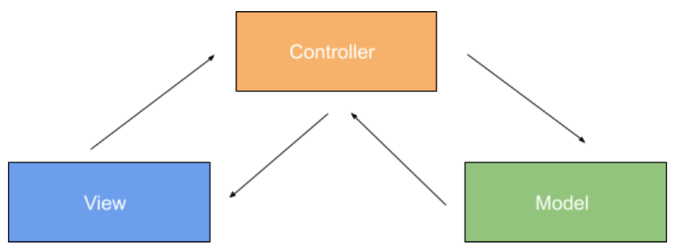

# PHP MVC

This project contains simple website MVC (Model-View-Controller) using PHP.

## What is MVC?

MVC stands for Model-View-Controller which is an architectural design pattern in software development.
MVC is divided into three parts, namely:
- Model : the part that manages and deals directly with the database
- View : the section that will present the display of information to the user
- Controller : the part that connects the model and view in every request process from the user.

with the mvc concept, can allow you to build your website to modular and easy to maintainance. so it's make the development process to easy and effective even if you working with teams. this concept many implemented on popular framework, like [Laravel](https://laravel.com/), [Codeigniter](https://codeigniter.com/), [Yii](https://www.yiiframework.com/) e.t.c. 

## The MVC Workflow

1. The <b>view</b> part will request information to be able showing to user
2. The request is then picked up by the <b>controller</b> and submitted to the <b>model</b> section for processing
3. The <b>model</b> returns to the controller to display the result in the <b>view</b>
4. The <b>controller</b> takes the processed results performed in the <b>model</b> section and organizes them in the <b>view</b> section

## Benefits of MVC
### 1. <b>More Efficient Website Development Process</b>

The MVC concept can make the website development process faster. Because, MVC divides the website into three separate parts. The model and controller parts can be done by the back end developer while the view can be done by the front end developer and UI UX team.

For example, after the UI UX team has finished designing the design of a website page, the back end and front end teams can start creating programming code for that design. The UI UX team can move on to designing other page designs such as user details pages.

### 2. <b>Testing Becomes Easier</b>
To ensure the website is functioning properly, testing steps need to be carried out. Now, by using the MVC framework, the testing process can be done per part that is ready, instead of waiting for the entire website to be finished.

In addition, making documentation of each feature can be more efficient and neat because the testing process can be done by section.

### 3. <b>Errors or Bugs are Faster and Easy to Handle</b>
The division of the website by MVC allows developers to focus more on their respective development sections. So, they can more quickly find bugs and fix them.

For example, when the cart function on an online store website doesn't work, the problem may lie in the data or buttons. Well, if it turns out that an error is found on the button (view), the front end can immediately fix the error.

### 4. <b>Easy Maintenance</b>
The MVC concept allows the use of scripts that are more structured and neat. This can make it easier for the developer team in the process of developing and maintaining a website.

Suppose you want to add a “add discount voucher” feature to your online store website. The development team, both back end and front end, will find it easier to find script code that needs to be added and updated.

